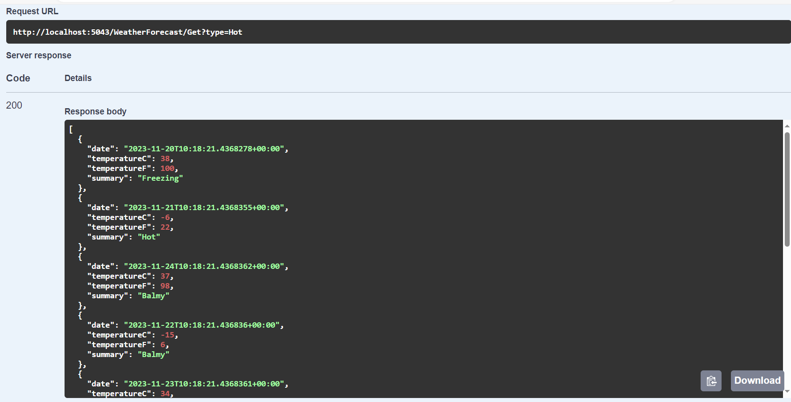

# Dapr Partitioning Issue

When querying documents in a CosmosDB statestore, it seems that dapr is not taking the partitionKey into respect.

## Make sure the CosmosDB Container is created using the following configuration:
``` bicep
resource container 'Microsoft.DocumentDB/databaseAccounts/sqlDatabases/containers@2020-04-01' = {
  parent: db
  name: 'masterdata'
  properties: {
    resource: {
      id: 'masterdata'
      defaultTtl: -1
      partitionKey: {
        paths: [
          '/partitionKey'
        ]
        ...
}
```
The important part here is the properties.resource.partitionKey.paths['/partitionKey'] property, as Dapr makes use of this field when specifying metadata.

## Save records
The `AddEntries` method adds some (well partitioned) records in the DB:

`GET http://localhost:5043/WeatherForecast/Add`

Result:


## Retrieve records

When running:
`GET http://localhost:5043/WeatherForecast/Get?type=Hot`
**all** results are returned, as - like expected - only the ones using the partitionKey `Hot`.



